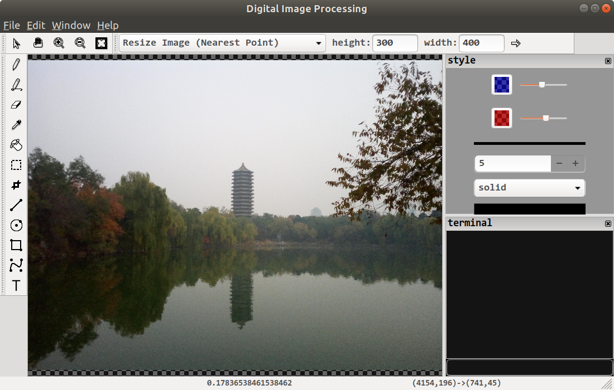

## 数字图像处理学习代码

### 概览
这里的数字图像处理代码仅供学习，不适于生产环境。代码分为 C++11 和 Python 编写的两部分。其中 jpeg.h 和 jpeg.cc 两个文件所包含的代码可以解析 JPEG 格式文件，transform.h 和 transform.cc 两个文件所包含的代码可以对图像进行一些变换操作。这些C++ 代码用 Swig编译成库，给 Python 调用。Python 部分主要是方便调试和图片显示，涉及算法的代码都用 C++ 编写。目前很多地方有待完善，欢迎补充算法代码和文档注释。

### 编译
- 依赖
	- C++编译器，需要能支持C++11语法
	- [Python3](https://www.python.org/)
	- [Swig](http://swig.org/) 用于将C++实现的部分做成可供Python调用的库
	- [NumPy](http://www.numpy.org/) Python库，用于线性代数运算
	- [Pillow](https://pypi.org/project/Pillow/) Python库，用于图像处理
	- [Matplotlib](https://matplotlib.org/) Python库，用于绘制图表
	- [CMake](https://cmake.org/) 用于实现跨平台编译  
	编译前请确定c++编译器、python3、swig和cmake所在路径已经添加到环境变量PATH中

- 编译C++代码，生成可供Python调用的动态链接库（_reversi.so或_reversi.pyd）  
	`cd build`  
	`cmake -DCMAKE_BUILD_TYPE=RELEASE
.` （请注意命令最后有英文句号。如果在UNIX或Linux平台上直接输入这个命令即可。如果是在windows平台上使用MinGW GCC编译，则应输入 `cmake -G"MinGW Makefiles"  -DCMAKE_BUILD_TYPE=RELEASE .`如果用VisualStudio请参照CMake文档或输入`cmake --help`查看帮助。）  
	`make`  
	`cd ..`  

### 样例
- 样例在sample/目录下
- 运行样例需要
	- 前面编译好的动态链接库_jpeg.so或_jpeg.pyd
	- [Python3](https://www.python.org/)
	- [NumPy](http://www.numpy.org/) Python库，用于线性代数运算
	- [Pillow](https://pypi.org/project/Pillow/) Python库，用于图像处理
	- [Matplotlib](https://matplotlib.org/) Python库，用于绘制图表

- 样例的运行（这里以运行jpeg_decode.py为例）  
	`cd sample`  
	`python3 jpeg_decode.py`  

###图像处理小程序
- 程序在app/目录下
- 截图

- 运行程序需要
	- 前面编译好的动态链接库_jpeg.so或_jpeg.pyd
	- [Python3](https://www.python.org/)
	- [NumPy](http://www.numpy.org/) Python库，用于线性代数运算
	- [Pillow](https://pypi.org/project/Pillow/) Python库，用于图像处理
	- [WxPython](https://www.wxpython.org/) Python库，是WxWidgets的Python版本，用于制作图形界面
- 程序的运行  
	`cd app`  
	`python3 main.py` 